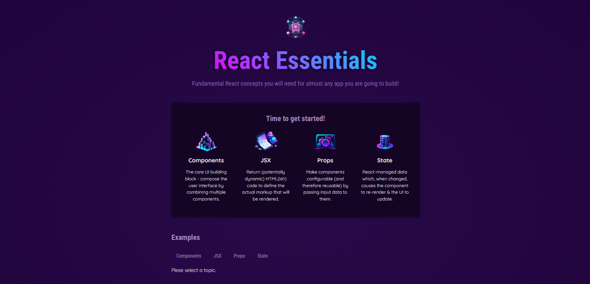

# 🚀 React Landing Page Demo

A simple one-page landing website built with React.  
This project marks the beginning of my React journey.

Here, I practiced:
- ✅ Component creation and reuse
- ✅ State management with `useState`
- ✅ Dynamic content loading and rendering


## 📸 Demo



---

## 🛠️ Tech Stack

- React
- Vite (or Create React App)
- CSS Modules /
- npm

---

## ✨ Features

- Clean design
- Component-based structure
- Easy to customize

---

## 📦 Installation

```bash
# Clone the repo
git clone https://github.com/suvaryanserhiy/react-landing-page-demo.git

# Install dependencies
cd react-landing-page-demo
npm install

# Start the dev server
npm dev  
